<h1 align="center">
  
</h1>

## ⚡ Quick Overview
- 🛠️ Currently developing high-value, optimized spatial computing frameworks.
- 🎨 Core focus: 3D graphics pipeline execution, shaders, and real-time engine systems.
- 📐 Backed by a strong foundation in linear algebra and 3D coordinate transformations.

---

## 🛠️ Immersive Tech Stack

| Domain | Tools & Technologies |
| :--- | :--- |
| **Engines & APIs** | `Unity3D` `Unreal Engine` `WebXR API` `Three.js` `WebGL` |
| **Languages** | `C#` `C++` `GLSL / HLSL` `TypeScript` |
| **Core Systems** | `Linear Algebra` `Performance Profiling` `Shader Development` |

---
<!-- PERMANENT RDR2 THEME LAYER (WEATHERED PARCHMENT & OUTLAW CRIMSON) -->

  

  
  
  

---

## 🤠 Pinned Repositories

<b>⚡ AsyncSpatial</b>

 
Solves browser memory bottlenecks for volumetric datasets by wrapping an optimized Unity WebGL C# ring buffer inside a reactive Vue 3 telemetry interface. Focuses on low-overhead memory cycles and efficient runtime telemetry processing.
  
<i>Tech Stack: <code>C#</code>, <code>Unity WebGL</code>, <code>Vue 3</code>, <code>TypeScript</code></i> 
  
🔗 <b><a href="https://github.com/GreeneRoman/AsyncSpatial">Inspect Source Architecture ↗</a></b>

 

<b>🧬 dna-triage-dashboard</b>

 
A clinical triage dashboard built as a Proof of Concept (PoC) for MIO-DNA interoperability, integrating strict data schemas under the HL7 FHIR standard for health and genetic data handling.
  
<i>Tech Stack: <code>TypeScript</code>, <code>FHIR Interoperability</code>, <code>Reactive Architecture</code></i> 
  
🔗 <b><a href="https://github.com/GreeneRoman/dna-triage-dashboard">Inspect Source Architecture ↗</a></b>

---

  <i>System Notice: Repositories tracked and compiled under RDR2 Frontier Code Tokens.</i>

## 🏗️ Featured Repositories

<b>⚡ AsyncSpatial</b>

 
Solves browser memory bottlenecks for volumetric datasets by wrapping an optimized Unity WebGL C# ring buffer inside a reactive Vue 3 telemetry interface. Focuses on low-overhead memory cycles and efficient runtime telemetry processing.
 
<i>Tech Stack: <code>C#</code>, <code>Unity WebGL</code>, <code>Vue 3</code>, <code>TypeScript</code></i> 
 
🔗 <b><a href="https://github.com/GreeneRoman/AsyncSpatial">View Repository</a></b>

<b>🧬 dna-triage-dashboard</b>

 
A clinical triage dashboard built as a Proof of Concept (PoC) for MIO-DNA interoperability, integrating strict data schemas under the HL7 FHIR standard for health and genetic data handling.
 
<i>Tech Stack: <code>TypeScript</code>, <code>FHIR Interoperability</code>, <code>Reactive Architecture</code></i> 
 
🔗 <b><a href="https://github.com/GreeneRoman/dna-triage-dashboard">View Repository</a></b>

---

## 📊 Live Contribution Stream
<!-- START_SECTION:activity -->
<!-- END_SECTION:activity -->

---

## 🥽 Immersive Simulation Matrix

<picture>
  <source media="(prefers-color-scheme: dark)" srcset="https://raw.githubusercontent.com/GreeneRoman/GreeneRoman/output/github-contribution-grid-snake-dark.svg" />
  <source media="(prefers-color-scheme: light)" srcset="https://raw.githubusercontent.com/GreeneRoman/GreeneRoman/output/github-contribution-grid-snake.svg" />
  
</picture>
